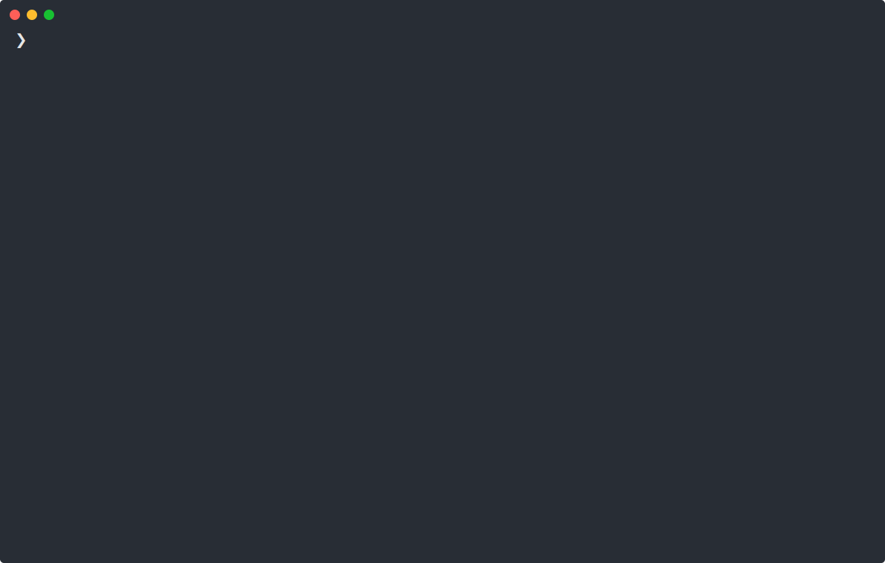

[](https://lycheeverse.github.io)
[](https://github.com/marketplace/actions/lychee-broken-link-checker)

[](https://docs.rs/lychee-lib)
[](https://github.com/lycheeverse/lychee/actions/workflows/links.yml)
[](https://hub.docker.com/r/lycheeverse/lychee)

⚡ A fast, async, stream-based link checker written in Rust.\
Finds broken hyperlinks and mail addresses inside Markdown, HTML,
reStructuredText, or any other text file or website!

Available as a command-line utility, a library and a [GitHub Action](https://github.com/lycheeverse/lychee-action).



## Installation

### Arch Linux

```sh
pacman -S lychee-link-checker
```

### macOS

```sh
brew install lychee
```

### Docker

```sh
docker pull lycheeverse/lychee
```

### NixOS

```sh
nix-env -iA nixos.lychee
```

### FreeBSD

```sh
pkg install lychee
```

### Termux

```sh
pkg install lychee
```

### Pre-built binaries

We provide binaries for Linux, macOS, and Windows for every release. \
You can download them from the [releases page](https://github.com/lycheeverse/lychee/releases).

### Cargo

#### Build dependencies

On APT/dpkg-based Linux distros (e.g. Debian, Ubuntu, Linux Mint and Kali Linux)
the following commands will install all required build dependencies, including
the Rust toolchain and `cargo`:

```sh
curl -sSf 'https://sh.rustup.rs' | sh
apt install gcc pkg-config libc6-dev libssl-dev
```

#### Compile and install lychee

```sh
cargo install lychee
```

## Features

This comparison is made on a best-effort basis. Please create a PR to fix
outdated information.

|                      | lychee  | [awesome_bot] | [muffet] | [broken-link-checker] | [linkinator] | [linkchecker]        | [markdown-link-check] | [fink] |
| -------------------- | ------- | ------------- | -------- | --------------------- | ------------ | -------------------- | --------------------- | ------ |
| Language             | Rust    | Ruby          | Go       | JS                    | TypeScript   | Python               | JS                    | PHP    |
| Async/Parallel       | ![yes]  | ![yes]        | ![yes]   | ![yes]                | ![yes]       | ![yes]               | ![yes]                | ![yes] |
| JSON output          | ![yes]  | ![no]         | ![yes]   | ![yes]                | ![yes]       | ![maybe]<sup>1</sup> | ![yes]                | ![yes] |
| Static binary        | ![yes]  | ![no]         | ![yes]   | ![no]                 | ![no]        | ️![no]               | ![no]                 | ![no]  |
| Markdown files       | ![yes]  | ![yes]        | ![no]    | ![no]                 | ![no]        | ![yes]               | ![yes]                | ![no]  |
| HTML files           | ![yes]  | ![no]         | ![no]    | ![yes]                | ![yes]       | ![no]                | ![yes]                | ![no]  |
| Text files           | ![yes]  | ![no]         | ![no]    | ![no]                 | ![no]        | ![no]                | ![no]                 | ![no]  |
| Website support      | ![yes]  | ![no]         | ![yes]   | ![yes]                | ![yes]       | ![yes]               | ![no]                 | ![yes] |
| Chunked encodings    | ![yes]  | ![maybe]      | ![maybe] | ![maybe]              | ![maybe]     | ![no]                | ![yes]                | ![yes] |
| GZIP compression     | ![yes]  | ![maybe]      | ![maybe] | ![yes]                | ![maybe]     | ![yes]               | ![maybe]              | ![no]  |
| Basic Auth           | ![yes]  | ![no]         | ![no]    | ![yes]                | ![no]        | ![yes]               | ![no]                 | ![no]  |
| Custom user agent    | ![yes]  | ![no]         | ![no]    | ![yes]                | ![no]        | ![yes]               | ![no]                 | ![no]  |
| Relative URLs        | ![yes]  | ![yes]        | ![no]    | ![yes]                | ![yes]       | ![yes]               | ![yes]                | ![yes] |
| Skip relative URLs   | ![yes]  | ![no]         | ![no]    | ![maybe]              | ![no]        | ![no]                | ![no]                 | ![no]  |
| Include patterns     | ![yes]️ | ![yes]        | ![no]    | ![yes]                | ![no]        | ![no]                | ![no]                 | ![no]  |
| Exclude patterns     | ![yes]  | ![no]         | ![yes]   | ![yes]                | ![yes]       | ![yes]               | ![yes]                | ![yes] |
| Handle redirects     | ![yes]  | ![yes]        | ![yes]   | ![yes]                | ![yes]       | ![yes]               | ![yes]                | ![yes] |
| Ignore insecure SSL  | ![yes]  | ![yes]        | ![yes]   | ![no]                 | ![no]        | ![yes]               | ![no]                 | ![yes] |
| File globbing        | ![yes]  | ![yes]        | ![no]    | ![no]                 | ![yes]       | ![no]                | ![yes]                | ![no]  |
| Limit scheme         | ![yes]  | ![no]         | ![no]    | ![yes]                | ![no]        | ![yes]               | ![no]                 | ![no]  |
| [Custom headers]     | ![yes]  | ![no]         | ![yes]   | ![no]                 | ![no]        | ![no]                | ![yes]                | ![yes] |
| Summary              | ![yes]  | ![yes]        | ![yes]   | ![maybe]              | ![yes]       | ![yes]               | ![no]                 | ![yes] |
| `HEAD` requests      | ![yes]  | ![yes]        | ![no]    | ![yes]                | ![yes]       | ![yes]               | ![no]                 | ![no]  |
| Colored output       | ![yes]  | ![maybe]      | ![yes]   | ![maybe]              | ![yes]       | ![yes]               | ![no]                 | ![yes] |
| [Filter status code] | ![yes]  | ![yes]        | ![no]    | ![no]                 | ![no]        | ![no]                | ![yes]                | ![no]  |
| Custom timeout       | ![yes]  | ![yes]        | ![yes]   | ![no]                 | ![yes]       | ![yes]               | ![no]                 | ![yes] |
| E-mail links         | ![yes]  | ![no]         | ![no]    | ![no]                 | ![no]        | ![yes]               | ![no]                 | ![no]  |
| Progress bar         | ![yes]  | ![yes]        | ![no]    | ![no]                 | ![no]        | ![yes]               | ![yes]                | ![yes] |
| Retry and backoff    | ![yes]  | ![no]         | ![no]    | ![no]                 | ![yes]       | ![no]                | ![yes]                | ![no]  |
| Skip private domains | ![yes]  | ![no]         | ![no]    | ![no]                 | ![no]        | ![no]                | ![no]                 | ![no]  |
| [Use as library]     | ![yes]  | ![yes]        | ![no]    | ![yes]                | ![yes]       | ![no]                | ![yes]                | ![no]  |
| Quiet mode           | ![yes]  | ![no]         | ![no]    | ![no]                 | ![yes]       | ![yes]               | ![yes]                | ![yes] |
| [Config file]        | ![yes]  | ![no]         | ![no]    | ![no]                 | ![yes]       | ![yes]               | ![yes]                | ![no]  |
| Recursion            | ![no]   | ![no]         | ![yes]   | ![yes]                | ![yes]       | ![yes]               | ![yes]                | ![no]  |
| Amazing lychee logo  | ![yes]  | ![no]         | ![no]    | ![no]                 | ![no]        | ![no]                | ![no]                 | ![no]  |

[awesome_bot]: https://github.com/dkhamsing/awesome_bot
[muffet]: https://github.com/raviqqe/muffet
[broken-link-checker]: https://github.com/stevenvachon/broken-link-checker
[linkinator]: https://github.com/JustinBeckwith/linkinator
[linkchecker]: https://github.com/linkchecker/linkchecker
[markdown-link-check]: https://github.com/tcort/markdown-link-check
[fink]: https://github.com/dantleech/fink
[yes]: ./assets/yes.svg
[no]: ./assets/no.svg
[maybe]: ./assets/maybe.svg
[custom headers]: https://github.com/rust-lang/crates.io/issues/788
[filter status code]: https://github.com/tcort/markdown-link-check/issues/94
[skip private domains]: https://github.com/appscodelabs/liche/blob/a5102b0bf90203b467a4f3b4597d22cd83d94f99/url_checker.go
[use as library]: https://github.com/raviqqe/liche/issues/13
[config file]: https://github.com/lycheeverse/lychee/blob/master/lychee.example.toml

<sup>1</sup> Other machine-readable formats like CSV are supported.

## Commandline usage

Recursively check all links in supported files inside the current directory

```sh
lychee .
```

You can also specify various types of inputs:

```sh
# check links in specific local file(s):
lychee README.md
lychee test.html info.txt

# check links on a website:
lychee https://endler.dev

# check links in directory but block network requests
lychee --offline path/to/directory

# check links in a remote file:
lychee https://raw.githubusercontent.com/lycheeverse/lychee/master/README.md

# check links in local files via shell glob:
lychee ~/projects/*/README.md

# check links in local files (lychee supports advanced globbing and ~ expansion):
lychee "~/projects/big_project/**/README.*"

# ignore case when globbing and check result for each link:
lychee --glob-ignore-case --verbose "~/projects/**/[r]eadme.*"

# check links from epub file (requires atool: https://www.nongnu.org/atool)
acat -F zip {file.epub} "*.xhtml" "*.html" | lychee -
```

lychee parses other file formats as plaintext and extracts links using [linkify](https://github.com/robinst/linkify). 
This generally works well if there are no format or encoding specifics,
but in case you need dedicated support for a new file format, please consider creating an issue.


### Docker Usage

Here's how to mount a local directory into the container and check some input
with lychee. The `--init` parameter is passed so that lychee can be stopped
from the terminal. We also pass `-it` to start an interactive terminal, which
is required to show the progress bar.

```sh
docker run --init -it -v `pwd`:/input lycheeverse/lychee /input/README.md
```

### GitHub Token

To avoid getting rate-limited while checking GitHub links, you can optionally
set an environment variable with your Github token like so `GITHUB_TOKEN=xxxx`,
or use the `--github-token` CLI option. It can also be set in the config file.
[Here is an example config file][config file].

The token can be generated in your
[GitHub account settings page](https://github.com/settings/tokens). A personal
token with no extra permissions is enough to be able to check public repos links.

### Commandline Parameters

There is an extensive list of commandline parameters to customize the behavior.
See below for a full list.

```ignore
USAGE:
    lychee [OPTIONS] <inputs>...

ARGS:
    <inputs>...    The inputs (where to get links to check from). These can be: files (e.g.
                   `README.md`), file globs (e.g. `"~/git/*/README.md"`), remote URLs (e.g.
                   `https://example.com/README.md`) or standard input (`-`). NOTE: Use `--` to
                   separate inputs from options that allow multiple arguments

OPTIONS:
    -a, --accept <ACCEPT>
            Comma-separated list of accepted status codes for valid links

    -b, --base <BASE>
            Base URL or website root directory to check relative URLs e.g. https://example.com or
            `/path/to/public`

        --basic-auth <BASIC_AUTH>
            Basic authentication support. E.g. `username:password`

    -c, --config <CONFIG_FILE>
            Configuration file to use [default: ./lychee.toml]

        --cache
            Use request cache stored on disk at `.lycheecache`

        --dump
            Don't perform any link checking. Instead, dump all the links extracted from inputs that
            would be checked

    -E, --exclude-all-private
            Exclude all private IPs from checking.
            Equivalent to `--exclude-private --exclude-link-local --exclude-loopback`

        --exclude <EXCLUDE>
            Exclude URLs from checking (supports regex)

        --exclude-file <EXCLUDE_FILE>
            Deprecated; use `--exclude-path` instead

        --exclude-link-local
            Exclude link-local IP address range from checking

        --exclude-loopback
            Exclude loopback IP address range and localhost from checking

        --exclude-mail
            Exclude all mail addresses from checking

        --exclude-path <EXCLUDE_PATH>
            Exclude file path from getting checked

        --exclude-private
            Exclude private IP address ranges from checking

    -f, --format <FORMAT>
            Output format of final status report (compact, detailed, json, markdown) [default:
            compact]

        --github-token <GITHUB_TOKEN>
            GitHub API token to use when checking github.com links, to avoid rate limiting [env:
            GITHUB_TOKEN]

        --glob-ignore-case
            Ignore case when expanding filesystem path glob inputs

    -h, --headers <HEADERS>
            Custom request headers

        --help
            Print help information

    -i, --insecure
            Proceed for server connections considered insecure (invalid TLS)

        --include <INCLUDE>
            URLs to check (supports regex). Has preference over all excludes

        --include-verbatim
            Find links in verbatim sections like `pre`- and `code` blocks

    -m, --max-redirects <MAX_REDIRECTS>
            Maximum number of allowed redirects [default: 5]

        --max-cache-age <MAX_CACHE_AGE>
            Discard all cached requests older than this duration [default: 1d]

        --max-concurrency <MAX_CONCURRENCY>
            Maximum number of concurrent network requests [default: 128]

        --max-retries <MAX_RETRIES>
            Maximum number of retries per request [default: 3]

    -n, --no-progress
            Do not show progress bar.
            This is recommended for non-interactive shells (e.g. for continuous integration)

    -o, --output <OUTPUT>
            Output file of status report

        --offline
            Only check local files and block network requests

    -r, --retry-wait-time <RETRY_WAIT_TIME>
            Minimum wait time in seconds between retries of failed requests [default: 1]

        --remap <REMAP>
            Remap URI matching pattern to different URI

        --require-https
            When HTTPS is available, treat HTTP links as errors

    -s, --scheme <SCHEME>
            Only test links with the given schemes (e.g. http and https)

        --skip-missing
            Skip missing input files (default is to error if they don't exist)

    -t, --timeout <TIMEOUT>
            Website timeout in seconds from connect to response finished [default: 20]

    -T, --threads <THREADS>
            Number of threads to utilize. Defaults to number of cores available to the system

    -u, --user-agent <USER_AGENT>
            User agent [default: lychee/0.10.1]

    -v, --verbose
            Verbose program output

    -X, --method <METHOD>
            Request method [default: get]
```

### Exit codes

- `0` for success (all links checked successfully or excluded/skipped as configured)
- `1` for missing inputs and any unexpected runtime failures or config errors
- `2` for link check failures (if any non-excluded link failed the check)

### Ignoring links

You can exclude links from getting checked by specifying regex patterns
with `--exclude` (e.g. `--exclude example\.(com|org)`).  
If a file named `.lycheeignore` exists in the current working directory, its
contents are excluded as well. The file allows you to list multiple regular 
expressions for exclusion (one pattern per line).

### Caching

If the `--cache` flag is set, lychee will cache responses in a file called
`.lycheecache` in the current directory. If the file exists and the flag is set,
then the cache will be loaded on startup. This can greatly speed up future runs.
Note that by default lychee will not store any data on disk.

## Library usage

You can use lychee as a library for your own projects!
Here is a "hello world" example:

```rust
use lychee_lib::Result;

#[tokio::main]
async fn main() -> Result<()> {
  let response = lychee_lib::check("https://github.com/lycheeverse/lychee").await?;
  println!("{response}");
  Ok(())
}
```

This is equivalent to the following snippet, in which we build our own client:

```rust
use lychee_lib::{ClientBuilder, Result, Status};

#[tokio::main]
async fn main() -> Result<()> {
  let client = ClientBuilder::default().client()?;
  let response = client.check("https://github.com/lycheeverse/lychee").await?;
  assert!(response.status().is_success());
  Ok(())
}
```

The client builder is very customizable:

```rust, ignore
let client = lychee_lib::ClientBuilder::builder()
    .includes(includes)
    .excludes(excludes)
    .max_redirects(cfg.max_redirects)
    .user_agent(cfg.user_agent)
    .allow_insecure(cfg.insecure)
    .custom_headers(headers)
    .method(method)
    .timeout(timeout)
    .github_token(cfg.github_token)
    .scheme(cfg.scheme)
    .accepted(accepted)
    .build()
    .client()?;
```

All options that you set will be used for all link checks.
See the [builder
documentation](https://docs.rs/lychee-lib/latest/lychee_lib/struct.ClientBuilder.html)
for all options. For more information, check out the [examples](examples)
folder.

## GitHub Action Usage

A GitHub Action that uses lychee is available as a separate repository: [lycheeverse/lychee-action](https://github.com/lycheeverse/lychee-action)
which includes usage instructions.

## Contributing to lychee

We'd be thankful for any contribution. \
We try to keep the issue-tracker up-to-date so you can quickly find a task to work on.

Try one of these links to get started:

- [good first issues](https://github.com/lycheeverse/lychee/issues?q=is%3Aissue+is%3Aopen+label%3A%22good+first+issue%22)
- [help wanted](https://github.com/lycheeverse/lychee/issues?q=is%3Aissue+is%3Aopen+label%3A%22help+wanted%22)

For more detailed instructions, head over to [`CONTRIBUTING.md`](/CONTRIBUTING.md).

## Debugging and improving async code

Lychee makes heavy use of async code to be resource-friendly while still being
performant. Async code can be difficult to troubleshoot with most tools,
however. Therefore we provide experimental support for
[tokio-console](https://github.com/tokio-rs/console). It provides a top(1)-like
overview for async tasks!

If you want to give it a spin, download and start the console:

```sh
git clone https://github.com/tokio-rs/console
cd console
cargo run
```

Then run lychee with some special flags and features enabled.

```sh
RUSTFLAGS="--cfg tokio_unstable" cargo run --features tokio-console -- <input1> <input2> ...
```

If you find a way to make lychee faster, please do reach out.

## Troubleshooting and Workarounds

We collect a list of common workarounds for various websites in our [troubleshooting guide](./docs/TROUBLESHOOTING.md).

## Users

- https://github.com/InnerSourceCommons/InnerSourcePatterns
- https://github.com/opensearch-project/OpenSearch
- https://github.com/ramitsurana/awesome-kubernetes
- https://github.com/papers-we-love/papers-we-love
- https://github.com/pingcap/docs
- https://github.com/microsoft/WhatTheHack
- https://github.com/Azure/ResourceModules
- https://github.com/nix-community/awesome-nix
- https://github.com/balena-io/docs
- https://github.com/launchdarkly/LaunchDarkly-Docs
- https://github.com/pawroman/links
- https://github.com/analysis-tools-dev/static-analysis
- https://github.com/analysis-tools-dev/dynamic-analysis
- https://github.com/mre/idiomatic-rust
- https://github.com/lycheeverse/lychee (yes, the lychee docs are checked with lychee 🤯)

If you are using lychee for your project, **please add it here**.

## Credits

The first prototype of lychee was built in [episode 10 of Hello
Rust](https://hello-rust.show/10/). Thanks to all Github- and Patreon sponsors
for supporting the development since the beginning. Also, thanks to all the
great contributors who have since made this project more mature.

## License

lychee is licensed under either of

- Apache License, Version 2.0, (LICENSE-APACHE or
  https://www.apache.org/licenses/LICENSE-2.0)
- MIT license (LICENSE-MIT or https://opensource.org/licenses/MIT)

at your option.
